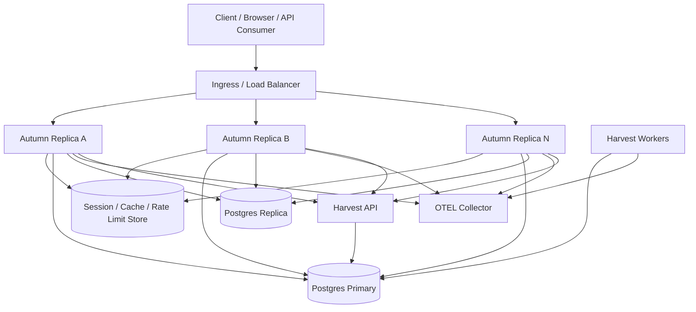

# ADR 0001: Adopt A Cloud-Native Foundation For Autumn

- Status: Proposed
- Date: 2026-04-09
- Deciders: Autumn maintainers
- Tags: architecture, operations, cloud-native, platform

## Context

Autumn aims to be a Spring Boot-style web framework for Rust: one deployable
service binary, strong defaults, escape hatches when needed, and an
operations story that does not require every application team to rediscover the
same plumbing.

Autumn already has a useful foundation:

- Profile-aware configuration and environment overrides
- Structured logging and request IDs
- Graceful shutdown
- `/health` and `/actuator/*` endpoints
- An in-memory metrics collector plus Prometheus export
- A distributed example that demonstrates Dockerized multi-replica deployment
- A companion workflow engine (`autumn-harvest`) for durable background work

That foundation is real, but it is not yet coherent enough to call Autumn
cloud-native.

Today, several critical runtime concerns are either incomplete or live in
application-specific escape hatches:

- Health is still effectively a single endpoint instead of distinct liveness,
  readiness, and startup contracts
- Metrics exist, but OpenTelemetry, trace context propagation, and OTLP export
  are not first-class
- Sessions default to process-local memory storage, which is wrong for
  horizontally scaled deployments
- Scheduled tasks still run in-process, and distributed safety requires
  application code to bolt on advisory locks
- Distributed database topology lives in example-specific state rather than in
  framework primitives
- Some config knobs are not wired end-to-end, which creates false confidence
  for operators
- `autumn new` does not yet generate a production-ready container and platform
  scaffold

Autumn can run in containers now. That is not the same thing as being a
first-class cloud-native framework.

## Decision

Autumn will adopt a cloud-native foundation with the following principles.

### 1. Cloud-native monolith first

Autumn will optimize for a single deployable service binary that is:

- stateless at the service edge
- horizontally scalable
- observable by default
- safe to deploy under orchestration

Autumn will not require microservices, a service mesh, or cross-service RPC to
claim cloud-native support. Microservices remain an application choice, not a
framework tax.

### 2. Operational contracts become first-class framework features

Autumn will treat the following as part of the framework contract rather than
application-specific middleware trivia:

- startup, liveness, and readiness probes
- graceful shutdown and connection draining
- request IDs and structured logs
- Prometheus-compatible metrics
- OpenTelemetry tracing and OTLP export
- profile-aware safe exposure of operational endpoints

If Autumn exposes an operational feature in configuration, the runtime must
honor it completely.

### 3. Mutable distributed state must move out of process memory

For multi-instance deployments, stateful concerns must use pluggable external
backends:

- sessions
- cache
- rate limiting state
- leases and distributed coordination
- durable job and workflow state

In-memory implementations remain valid for local development, tests, and
single-instance deployments, but they are not the production default for
distributed workloads.

### 4. Durable background work belongs to Harvest, not to wishful thinking

Autumn will keep in-process scheduled tasks for lightweight local work and
simple singleton use cases.

For durable, replayable, or distributed background execution, Autumn will
standardize on `autumn-harvest` integration rather than stretching the
in-process scheduler beyond its reliability boundary.

This draws a clear line:

- `#[scheduled]` remains convenience-oriented
- Harvest handles queues, leases, retries, replay, and multi-worker execution

### 5. Data topology becomes explicit

Autumn will grow first-class primitives for production data topologies where
they materially improve correctness and reduce per-app ceremony:

- primary/replica database roles
- one-shot migration runners
- topology-aware readiness checks
- pool policy configuration for read/write paths

Autumn will not pretend every deployment is a single Postgres URL forever.

### 6. Container-first packaging becomes part of the developer workflow

`autumn new` and related tooling will generate and document a deployment shape
that is viable under Kubernetes, ECS, Nomad, or similar orchestrators:

- multi-stage Dockerfile
- non-root runtime image
- `.dockerignore`
- environment-driven configuration examples
- probe examples
- migration job guidance
- reference manifests or charts

Autumn should not require every new application to reinvent container packaging
from scratch.

### 7. Local development stays simple

Cloud-native support must not poison the local developer experience.

Autumn will preserve:

- single-binary local startup
- profile-based defaults
- in-memory fallback backends where safe
- opt-in production infrastructure

The target is "Spring Boot feel, Rust rigor, cloud-native runtime", not
"everyone becomes a platform engineer before `cargo run` works."

## Target Architecture

## Consequences

### Positive

- Autumn gains a coherent production story instead of a bag of partially
  connected ops features
- Operators get standard probe, logging, metrics, and tracing contracts
- Distributed correctness moves from application folklore into framework
  guidance and primitives
- Background execution has a clear home instead of blurring process-local cron
  with durable workflow semantics
- Deployment scaffolding becomes reusable and consistent across applications

### Negative

- The framework surface area grows, especially around telemetry, state backends,
  and deployment configuration
- Supporting both local simplicity and production correctness increases testing
  burden
- Some current defaults will need to be narrowed or deprecated because they are
  safe only for single-instance deployments
- More optional dependencies and feature-gated integrations will be required

### Risks

- Over-rotating into infrastructure fashion and bloating the core framework
- Hiding distributed truth behind magic abstractions that fail under load
- Fragmenting the developer experience if Autumn, Harvest, and deployment
  tooling evolve independently

## Phased Rollout

### Phase 0: Truth Before Marketing

Fix operational drift so exposed config matches runtime behavior.

- Wire every existing config knob end-to-end
- Remove or deprecate fake knobs
- Tighten startup failure reporting for misconfigured production features
- Document which backends and defaults are local-only versus production-safe

### Phase 1: Cloud-Native Foundation

Establish the minimum bar for safe orchestrated deployments.

- Add `/live`, `/ready`, and `/startup`
- Add built-in OpenTelemetry and OTLP support
- Add pluggable production session backends
- Generate production container scaffolding from the CLI
- Make operational endpoint exposure and path configuration fully consistent

### Phase 2: Distributed Runtime

Move from "container-friendly" to "multi-replica correct."

- Add distributed coordination primitives such as leases or leader election
- Standardize Harvest for durable background work
- Introduce first-class primary/replica database support
- Add external cache and rate-limit storage options
- Add topology-aware readiness and migration job support

### Phase 3: Platform Polish

Make Autumn pleasant for real operators, not just framework authors.

- Ship reference Helm or Kustomize manifests
- Add multi-replica integration tests and deployment smoke tests
- Provide example dashboards, alerts, and SLO guidance
- Document rolling deploys, drain behavior, and failure modes

## Alternatives Considered

### 1. Keep the current escape-hatch approach

Autumn could continue relying on examples and application-specific glue for
distributed concerns.

Rejected because this produces per-app reinvention, inconsistent production
behavior, and weakens Autumn's value proposition as an opinionated framework.

### 2. Define cloud-native as microservices-first

Autumn could steer users toward service decomposition, cross-service RPC, and
mesh-native assumptions.

Rejected because it solves the wrong problem. Most teams first need a strong
single-service deployment model with good operations, not compulsory
distributed systems cosplay.

### 3. Treat cloud-native as documentation only

Autumn could publish deployment guides and examples without changing core
runtime behavior.

Rejected because the biggest gaps are runtime gaps: state management,
observability, probe semantics, and background execution boundaries.

## Non-Goals

- Requiring Kubernetes as the only supported deployment target
- Forcing microservices or service-mesh adoption
- Replacing Autumn's current local-first developer ergonomics
- Making every feature distributed by default
- Hiding reliability trade-offs behind magic defaults

## Follow-On Work

This ADR authorizes the following follow-up work:

1. Create implementation ADRs or design docs for probe semantics,
   observability, state backends, and Harvest integration
2. Prioritize Phase 0 and Phase 1 items in the roadmap
3. Add production-safety language to docs and templates where current defaults
   are intentionally local-only

## Decision Summary

Autumn will pursue a cloud-native foundation as a first-class architectural
direction.

The framework will remain monolith-friendly and local-first, but production
contracts such as probes, telemetry, externalized state, durable background
execution, and container-first packaging will become explicit framework
responsibilities rather than scattered application glue.
