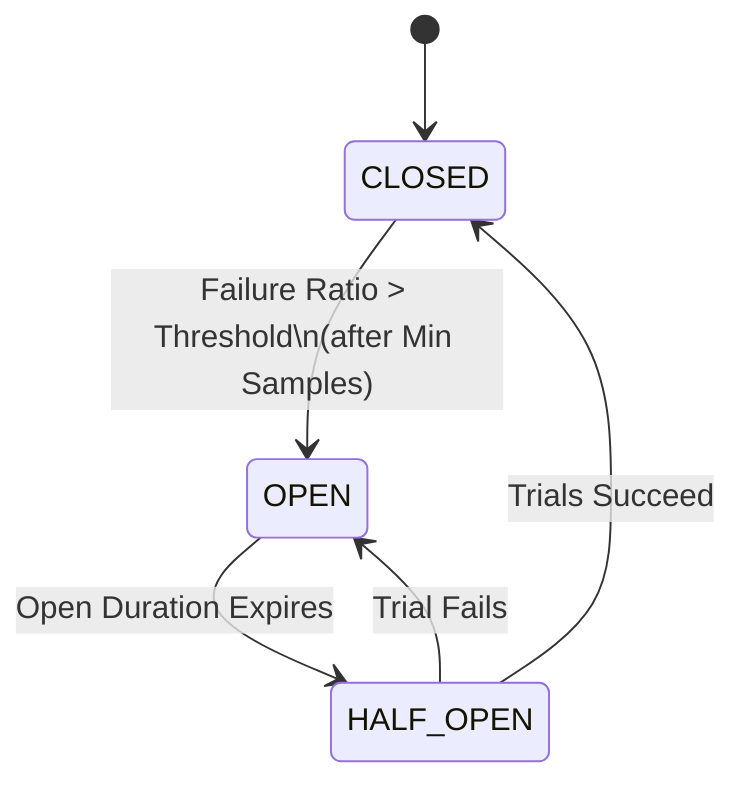

# Resilience & Outbound Circuit Breakers

Autumn provides a first-class `CircuitBreaker` resilience policy for outbound dependencies (HTTP clients, background jobs, and SMTP mailers) to protect the application from cascading failures during downstream outages.

---

## Core Concepts

A circuit breaker wraps outbound calls and tracks their success/failure ratio. It operates as a state machine with three states:



- **CLOSED**: Requests pass through normally. Successes and failures are tracked in a sliding window.
- **OPEN**: Requests fail fast immediately with a `503 Service Unavailable` error (`ClientError::CircuitBreakerOpen` for HTTP, `MailError::RuntimeUnavailable` for mailers, etc.) without contacting the remote dependency.
- **HALF_OPEN**: A limited number of trial requests are sent. If all trials succeed, the circuit closes again; if any trial fails, it immediately re-opens.

---

## Configuration

Circuit breakers are configured in `autumn.toml` under the `[resilience.circuit_breaker]` section. You can set global defaults and define per-host overrides.

```toml
# autumn.toml
[resilience.circuit_breaker.defaults]
failure_ratio_threshold = 0.5    # Trip when >= 50% of calls fail (default: 0.5)
sample_window_secs      = 10     # Track last 10 seconds of traffic (default: 10)
minimum_sample_count    = 10     # Require at least 10 calls to trip (default: 10)
open_duration_secs      = 60     # Keep circuit open for 60 seconds (default: 60)
half_open_trial_count   = 3      # Run 3 trial requests in Half-Open (default: 3)

# Per-host overrides for outbound HTTP clients
[resilience.circuit_breaker.hosts."api.stripe.com"]
failure_ratio_threshold = 0.3
minimum_sample_count    = 5
open_duration_secs      = 30

[resilience.circuit_breaker.hosts."api.sendgrid.com"]
open_duration_secs      = 10
```

---

## Integrations

### Outbound HTTP Client
The outbound [Client](file:///c:/Users/markm/autumn/autumn/src/http_client.rs) automatically attaches a circuit breaker keyed by target host to every outgoing request.
- **Successes**: Any HTTP response with status `< 500`.
- **Failures**: Any network timeout, connection error, or HTTP status `>= 500`.

### Background Jobs
All background job enqueues (to Redis or PostgreSQL durable queues) in [JobClient](file:///c:/Users/markm/autumn/autumn/src/job.rs) are wrapped in a circuit breaker named `"job_queue"`. If the queue store experiences an outage, subsequent enqueue calls fail fast, preventing thread starvation.

### SMTP Mailer
Outgoing SMTP transport sends in [SmtpTransport](file:///c:/Users/markm/autumn/autumn/src/mail.rs) are wrapped in a circuit breaker named `"smtp_mailer"`. If the mail server goes down, mail sends fail fast immediately.

---

## Actuator Visibility

### Breaker State Endpoint
The `GET <actuator-prefix>/circuitbreakers` endpoint returns the current state of all active breakers.

- **Detailed Mode** (`health.detailed = true`):
  ```json
  [
    {
      "name": "api.stripe.com",
      "state": "CLOSED",
      "failure_ratio": 0.1,
      "failure_ratio_threshold": 0.3,
      "sample_window": "10s",
      "minimum_sample_count": 5,
      "open_duration": "30s",
      "half_open_trial_count": 3
    }
  ]
  ```
- **Undetailed Mode** (`health.detailed = false` in production):
  ```json
  [
    {
      "name": "api.stripe.com",
      "state": "CLOSED",
      "failure_ratio": 0.1
    }
  ]
  ```

### Health Integration & Downstream Outage Pattern
Every circuit breaker exposes its state as a `HealthIndicator` mapped under `components.circuit_breaker.<name>` on the `/actuator/health` endpoint.

To support the **Downstream Outage Pattern**, breaker health indicators are registered in the `HealthOnly` group:
- While a breaker is `OPEN`, `/actuator/health` returns `503 Service Unavailable` and displays status `DOWN` for that circuit.
- Crucially, the readiness probe endpoints `/health` and `/ready` remain `UP` (`200 OK`). This prevents Kubernetes from killing or removing the application replica from the load balancer pool simply because a third-party dependency (like Stripe or SendGrid) is down.

---

## Telemetry & Logging

Circuit state transitions are instrumented with the `tracing` ecosystem. Every transition emits a structured tracing event with attributes:
- `circuit.name`: The key of the circuit breaker (e.g. host name, `"job_queue"`, or `"smtp_mailer"`).
- `circuit.state`: The target state (`CLOSED`, `OPEN`, or `HALF_OPEN`).
- `circuit.failure_ratio`: The failure ratio that triggered the transition.

Example transition log:
```
INFO circuit_breaker: Transitioned to OPEN circuit.name="api.stripe.com" circuit.state="OPEN" circuit.failure_ratio=0.6
```
